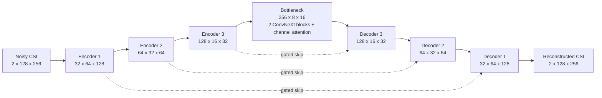

# LocandKey

LocandKey is a PyTorch system for denoising complex-valued channel state information (CSI). The current model receives a noisy channel tensor and reconstructs its clean real and imaginary components. It is trained across indoor, outdoor, campus, and urban scenarios spanning sub-6 GHz and 28 GHz data.

The repository currently implements and evaluates **CSI denoising**. Key generation, reconciliation, encryption, and covert communication are research directions, not completed features; they are documented in [future_work.md](future_work.md).

## Current Scope

The implemented pipeline is:

1. Validate scenario arrays and create deterministic train, validation, and test indices.
2. Load only the required samples from memory-mapped NumPy arrays.
3. Normalize each complex CSI sample to unit energy.
4. Add complex additive white Gaussian noise (AWGN) at a controlled SNR.
5. Reconstruct clean CSI with a compact attention-gated ConvNeXt U-Net.
6. Evaluate reconstruction error and correlation on untouched test indices.

The model input and output both have shape `(N, 2, 128, 256)`:

- channel `0`: real component
- channel `1`: imaginary component
- `128`: spatial/antenna dimension
- `256`: subcarrier dimension

The source arrays are stored as `(N, 128, 256, 2)` and are transposed when batches are prepared.

## Why CSI Denoising?

Estimated wireless channels contain thermal noise, estimation error, and environment-dependent variation. Downstream channel processing benefits from preserving the physical structure of the channel while reducing that noise. This is a dense reconstruction problem: every complex value in the input has a corresponding clean target value.

The system therefore learns the mapping

```text
noisy complex CSI -> reconstructed clean complex CSI
```

rather than predicting a class or a single scalar. The output must retain fine local structure while also using broader spatial and frequency context.

## Model Architecture

The model is `ResonanceModel`, an attention-gated U-Net built from ConvNeXt-style blocks. The verified training configuration contains approximately **1.997 million parameters**.



### Encoder

The encoder progressively reduces spatial resolution and increases feature depth:

| Stage | Operation | Output shape per sample |
| --- | --- | --- |
| Input | Real and imaginary CSI channels | `2 x 128 x 256` |
| Encoder 1 | `4 x 4`, stride-2 convolution; normalization; ConvNeXt block | `32 x 64 x 128` |
| Encoder 2 | `2 x 2`, stride-2 convolution; normalization; ConvNeXt block | `64 x 32 x 64` |
| Encoder 3 | `2 x 2`, stride-2 convolution; normalization; ConvNeXt block | `128 x 16 x 32` |
| Bottleneck | `2 x 2`, stride-2 convolution; two ConvNeXt blocks; channel attention | `256 x 8 x 16` |

Downsampling expands the receptive field, allowing the model to identify patterns that extend across antennas and neighboring subcarriers rather than treating each channel coefficient independently.

### ConvNeXt Blocks

Each ConvNeXt-style block contains:

1. A `7 x 7` depthwise convolution for broad local context at low computational cost.
2. Channel-wise normalization at every spatial location.
3. A pointwise expansion to four times the channel width.
4. GELU activation.
5. A pointwise projection back to the requested width.
6. A residual connection, with a `1 x 1` projection when channel counts differ.

Depthwise convolution separates spatial filtering from channel mixing. The pointwise layers then learn interactions between feature channels. Residual connections make optimization easier and help preserve information through the network.

### Bottleneck Channel Attention

At the lowest-resolution representation, the model calculates both spatial average and maximum summaries. A shared two-layer `1 x 1` network converts those summaries into sigmoid channel weights, which rescale the latent features.

This lets the network emphasize feature channels that are useful for the current CSI sample and suppress weaker ones. Applying this operation at the bottleneck keeps its computational cost small.

### Attention-Gated Skip Connections

A standard U-Net copies encoder features directly into the decoder. LocandKey first filters each skip connection with an attention gate conditioned on the corresponding decoder feature map. The gated encoder features are concatenated with the upsampled decoder features and refined by another ConvNeXt block.

The skips preserve high-resolution channel detail that could be lost during downsampling. The gates reduce the amount of irrelevant or noise-dominated encoder information passed into reconstruction.

### Output Layer

The final decoder stage upsamples to `128 x 256`, reduces the representation to 16 channels, and uses a `1 x 1` convolution to produce two output channels. These are interpreted as the reconstructed real and imaginary CSI components.

The final reconstruction and loss calculation remain in float32 even when mixed-precision training is enabled. This avoids unnecessary precision loss in the values used to calculate NMSE.

## Why This Architecture?

The architecture was selected as a practical balance for this dataset and the available Kaggle hardware:

- **U-Net structure:** matches a same-size input/output reconstruction task and combines global context with fine detail.
- **ConvNeXt-style blocks:** provide a larger local receptive field and efficient depthwise/pointwise computation without making the model large.
- **Residual paths:** support stable optimization in deeper feature processing.
- **Attention-gated skips:** retain high-resolution structure while filtering noisy skip features.
- **Channel attention:** allows adaptive emphasis of latent feature types.
- **Compact size:** roughly two million parameters fits comfortably on Kaggle T4 GPUs and is proportionate to the available data.

The choice is an engineering rationale, not a claim that every alternative was experimentally defeated. A controlled architecture ablation has not yet been completed.

| Alternative | Relevant trade-off |
| --- | --- |
| Plain convolutional autoencoder | Simple, but an encoder-decoder without skips can lose fine CSI detail. |
| Vanilla U-Net | Strong baseline, but uses less expressive local blocks and unfiltered skip connections. |
| Very deep residual CNN | Can denoise well, but does not obtain multiscale context as directly. |
| Transformer/global attention model | Can model long-range interactions, but has higher memory and data requirements for this tensor size. |
| Selected ConvNeXt U-Net | Preserves multiscale detail with a compact parameter and memory budget. |

Future work should validate these trade-offs with matched seeds, training budgets, and test splits rather than relying only on architectural expectations.

## Dataset Scenarios

Five scenarios are converted to the same `128 x 256 x 2` representation:

| Scenario | Environment represented by the dataset name | Frequency label | Source samples | Train | Validation | Test |
| --- | --- | ---: | ---: | ---: | ---: | ---: |
| `asu_campus_3p5` | ASU campus | 3.5 GHz | 20,000 | 14,000 | 3,000 | 3,000 |
| `city_16_sanfrancisco_28` | San Francisco urban | 28 GHz | 20,000 | 14,000 | 3,000 | 3,000 |
| `city_4_phoenix_28` | Phoenix urban | 28 GHz | 13,489 | 9,442 | 2,023 | 2,024 |
| `i1_2p4` | DeepMIMO I1 indoor | 2.4 GHz | 20,000 | 14,000 | 3,000 | 3,000 |
| `o1_28` | DeepMIMO O1 outdoor | 28 GHz | 20,000 | 14,000 | 3,000 | 3,000 |
| **Total** |  |  | **93,489** | **65,442** | **14,023** | **14,024** |

All 93,489 source samples passed the finite-value and nonzero-energy checks in the verified baseline split.

### Why These Scenarios?

The scenario set provides several useful kinds of variation:

- **Environment diversity:** indoor, outdoor, campus, and two urban settings expose the model to different channel structures.
- **Frequency diversity:** 2.4 GHz and 3.5 GHz sub-6 GHz data are combined with 28 GHz millimeter-wave data.
- **Urban variation:** two different cities at 28 GHz support both mixed-scenario training and a separate leave-one-city-out generalization experiment.
- **Shared representation:** every scenario is transformed to the same tensor dimensions, allowing one model to learn common structure across them.

The exact ray-tracing and antenna-generation settings should be read from the source dataset generation configuration. The labels above describe what is encoded in the scenario names and should not be treated as a complete propagation specification.

The baseline split includes samples from every scenario in train, validation, and test. It measures performance on unseen samples from known scenario distributions. A separate Phoenix holdout experiment excludes Phoenix from model fitting to measure transfer to an unseen city; its results are intentionally omitted until that experiment is complete.

## Preprocessing Pipeline

Preprocessing and memory-mapped batch construction are implemented in [preprocess.py](preprocess.py).

### 1. Scenario discovery and validation

The preprocessor discovers `data/generated/<scenario>/channels.npy` files and verifies that each array:

- is four-dimensional;
- has sample shape `(128, 256, 2)`;
- uses `float32` values;
- contains finite sampled values;
- contains nonzero-energy samples.

Invalid or zero-energy entries are excluded before splitting.

### 2. Memory-mapped loading

Scenario arrays are opened with NumPy memory mapping. A batch reads only its referenced rows instead of loading the full dataset into RAM. This is important because the complete generated dataset is much larger than the memory available to a normal training process.

### 3. Deterministic stratified splitting

Each scenario is shuffled independently using seed `42`, then split into approximately:

- 70% training
- 15% validation
- 15% test

The code verifies that the index sets do not overlap. Keeping each scenario represented in all baseline partitions prevents a large scenario from dominating one partition and supports scenario-level reporting on the test set.

The split files and summary are hashed into a fingerprint. Checkpoints record this fingerprint so evaluation can reject mismatched data partitions.

### 4. Per-sample energy normalization

For each complex sample `H`, the loader applies:

```text
H_normalized = H / sqrt(sum(real(H)^2 + imag(H)^2))
```

This removes absolute scale as a shortcut and asks the network to learn channel structure. It also makes a requested SNR comparable across samples with different original energy.

### 5. On-the-fly complex AWGN

Noise is generated while batches are assembled rather than saved as separate arrays. For target SNR `s` in decibels, the linear ratio is `10^(s/10)`. Equal independent Gaussian noise is added to the real and imaginary components, with the total complex noise power set from that ratio.

This approach:

- avoids storing many noisy copies of the same clean sample;
- presents new noise realizations over training epochs;
- supports evaluation at arbitrary SNR values;
- remains reproducible through deterministic seeds.

Training SNR is sampled independently per example from a uniform range of **-10 dB to 30 dB**. This teaches one model to handle both severe and mild noise. Validation uses a fixed **10 dB** SNR so epoch-to-epoch model selection is comparable.

### 6. Deterministic epoch and batch generation

Training order and noise are derived from the seed, epoch, and batch identity. Different epochs receive different noise, while rerunning the same configuration reproduces the same sequence. Validation remains fixed across epochs.

## Objective Function

The total training objective is:

```text
loss = normalized_MSE + 0.05 * magnitude_loss
```

### Normalized mean squared error

```text
NMSE = mean((prediction - target)^2) / (mean(target^2) + 1e-8)
```

NMSE measures reconstruction error relative to clean-signal energy. It is the main objective because absolute MSE alone would give more influence to high-energy samples.

### Complex-magnitude loss

The model also compares the magnitude of each predicted complex coefficient with the target magnitude:

```text
|H| = sqrt(real(H)^2 + imag(H)^2)
```

The `0.05` weight keeps complex reconstruction as the primary objective while adding a smaller penalty for distorted amplitude structure.

## Training Configuration

The verified baseline was trained on two Tesla T4 GPUs using PyTorch DistributedDataParallel (DDP): one process per GPU, mixed precision, and synchronized gradients.

| Setting | Value |
| --- | --- |
| Epochs | 60 |
| Global batch size | 8 (`4` samples per GPU) |
| Optimizer | Adam |
| Initial learning rate | `3e-4` |
| Adam epsilon | `1e-7` |
| Schedule | Cosine annealing to `1e-6` |
| Gradient clipping | Maximum norm `1.0` |
| Early-stopping patience | 10 epochs |
| Seed | 42 |
| Training SNR | Uniform from -10 to 30 dB per sample |
| Validation SNR | Fixed at 10 dB |
| Model selection | Lowest validation NMSE in linear space |

DDP is used instead of `DataParallel` because each GPU owns a separate training process and a disjoint sampler shard. This avoided the large host-memory growth observed with the earlier `DataParallel` implementation and uses both Kaggle GPUs effectively.

Only rank zero writes metrics and checkpoints. The resumable `.last.pt` checkpoint contains model, optimizer, scheduler, scaler, early-stopping state, random-number state, sample counts, and split fingerprint.

## Evaluation Metrics

Evaluation reports the following for each scenario and for the overall test set:

- **NMSE (dB):** `10 * log10(NMSE)`. More negative is better.
- **NMSE gain (dB):** noisy-input NMSE minus model-output NMSE. Positive means denoising improved the input.
- **MAE:** mean absolute component error. Lower is better.
- **Complex correlation:** agreement between reconstructed and clean complex channel structure. Closer to `1` is better.

The untouched baseline test set contains 14,024 samples. It was evaluated at nine SNRs from -10 dB through 30 dB, producing five scenario rows plus one overall row at every SNR.

## Verified Baseline Results

The best checkpoint was selected at epoch 59 of the 60-epoch run. The full test evaluation completed with finite metrics and the original split fingerprint.

| Input SNR | Noisy input NMSE | Model NMSE | NMSE gain | Approximate error-energy reduction |
| ---: | ---: | ---: | ---: | ---: |
| 0 dB | -0.0001 dB | -23.3603 dB | **23.3601 dB** | about **217x** |
| 10 dB | -10.0003 dB | -28.0631 dB | **18.0628 dB** | about **64x** |
| 30 dB | -30.0000 dB | -33.7043 dB | **3.7043 dB** | about **2.3x** |

Denoising gain was positive for all 45 tested scenario/SNR combinations. The gain naturally becomes smaller at high SNR because the noisy input is already close to the clean target.

These results demonstrate strong reconstruction on held-out samples from the five known scenario distributions. They do not, by themselves, prove generalization to an unseen environment; that is the purpose of the separate Phoenix holdout experiment.

## Results and Figures

Organized Kaggle artifacts are described in [kaggle-output/README.md](kaggle-output/README.md).

Faculty-ready material is available in:

- [Performance report](output/pdf/locandkey_performance_report.pdf)
- [Figure explanations](output/figures/locandkey_baseline/EXPLANATIONS.md)
- [Packaged graphs](output/locandkey_faculty_graphs.zip)

The raw baseline artifacts are kept under:

```text
kaggle-output/baseline/training/
kaggle-output/baseline/evaluation/
```

## Repository Layout

```text
LocandKey/
|-- model.py                 # ResonanceModel architecture and loss
|-- preprocess.py            # Validation, splits, batching, normalization, and AWGN
|-- train.py                 # Single-GPU and DDP training entry point
|-- eval.py                  # Core evaluation and holdout comparison utilities
|-- kaggle/                  # Kaggle build, launch, diagnostics, and evaluation
|-- kaggle-output/           # Downloaded and organized Kaggle artifacts
|-- output/                  # Presentation-ready reports and figures
|-- tests/                   # Local regression tests
`-- future_work.md           # Research directions beyond implemented denoising
```

## Running the Code

Install the project dependencies:

```powershell
python -m venv .venv
.venv\Scripts\python.exe -m pip install -r requirements.txt
```

Create or validate splits:

```powershell
.venv\Scripts\python.exe preprocess.py --data-root data
```

Run local training:

```powershell
.venv\Scripts\python.exe train.py --data-root data --split-dir data/splits
```

For the two-GPU Kaggle workflow, bundle creation, smoke testing, DDP launch, resume behavior, and output locations, see [kaggle/README.md](kaggle/README.md).

## Limitations

- The baseline test split contains unseen samples, but not unseen scenario distributions.
- Architecture comparisons have not yet been run as controlled ablations.
- Simulated channel data cannot fully represent hardware impairments, mobility, calibration error, or real deployment drift.
- A fixed 10 dB validation condition may favor a checkpoint that is not optimal at every SNR.
- The current repository reconstructs CSI; it does not yet implement a secure key-establishment protocol.

## Future Work

Planned generalization studies, architecture ablations, real-world validation, and cryptographic key-generation research are documented separately in [future_work.md](future_work.md). Keeping those topics separate prevents proposed security applications from being mistaken for features already implemented or validated.
