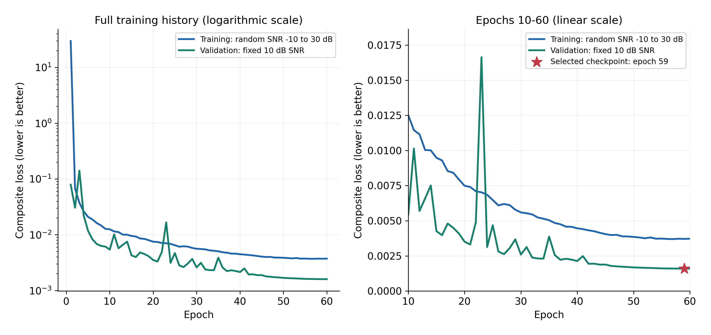
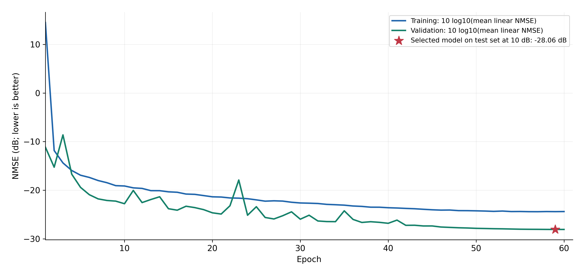
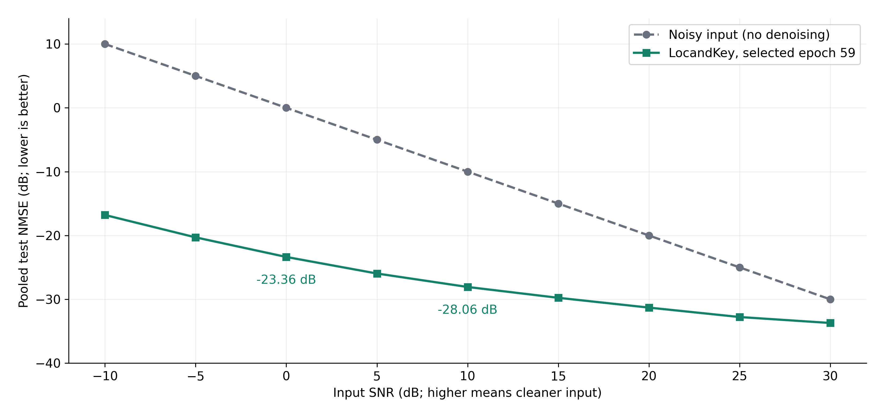
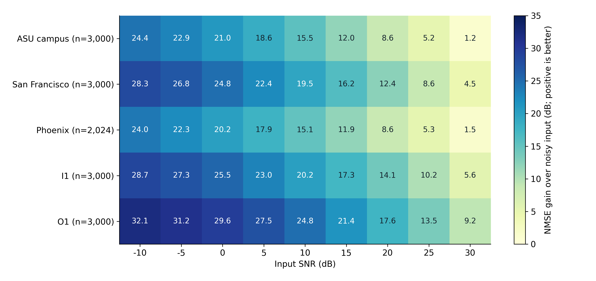
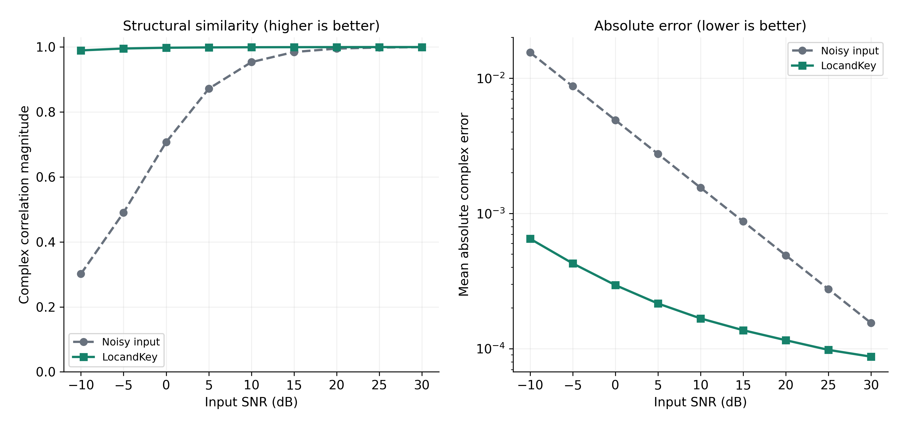
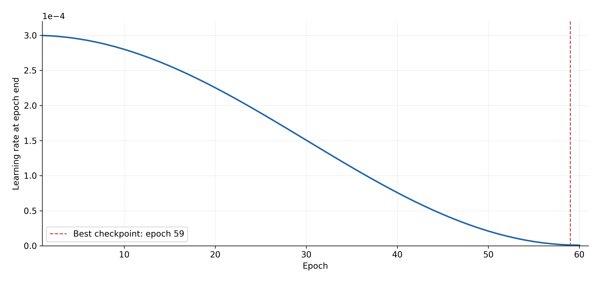

# LocandKey: faculty graph notes

Completed 60-epoch baseline; selected checkpoint: epoch 59. Phoenix holdout is not included.

65,442 training / 14,023 validation / 14,024 test samples. Single seed: 42. Nine test SNRs, -10 to 30 dB.

## Training and validation loss

**How to read it:** Loss combines normalized reconstruction error with a magnitude penalty (weight 0.05). Lower is better. The left panel retains the large initial loss; the right panel reveals late-training behavior. Curves are unsmoothed.

**Inference:** Training loss falls from 29.67 to 0.00372. Validation loss ends at 0.00160. The early validation spike is followed by recovery, with smaller improvements late in training.

**What not to claim:** Training spans random -10 to 30 dB noise; validation is fixed at 10 dB. Training is also measured while weights change within each epoch. Therefore the gap is not a clean overfitting measure.

## Reconstruction error through training

**How to read it:** NMSE measures error energy relative to clean-signal energy. Here the epoch's sample-weighted mean linear NMSE is converted to dB; it is not the log's mean of batch-level dB values.

**Inference:** Epoch 59, chosen only by minimum validation linear NMSE, reaches -28.08 dB on validation. Its independent test score at 10 dB is -28.06 dB, a close result on the same scenario mixture.

**What not to claim:** The previously reported -29.60 dB validation value averages batch dB scores. Averaging before versus after the logarithm differs. Training also includes harder noise levels; these scores are not classification accuracy.

## Test performance across noise levels

**How to read it:** Each point evaluates all 14,024 held-out test samples. Error and signal energies are pooled across samples before converting their ratio to dB. The vertical gap measures improvement over noisy input.

**Inference:** At 0 dB input SNR, NMSE improves by 23.36 dB (about 217 times less error energy). At 10 dB, improvement is 18.06 dB (about 64 times less). Even at 30 dB, improvement remains 3.70 dB.

**What not to claim:** These are simulated AWGN tests on held-out samples from environments represented in training. They do not yet establish performance on unseen environments or real measured noise. Phoenix holdout results are excluded.

## Denoising gain by environment

**How to read it:** Each cell is noisy-input NMSE minus model NMSE for one scenario and SNR. Positive numbers mean denoising helps. Sample counts are per SNR; the same clean test samples are evaluated with new deterministic noise.

**Inference:** All 45 scenario/SNR combinations improve, with gains from 1.18 to 32.05 dB. At 10 dB input, scenario gains range from 15.12 to 24.78 dB. Both preset acceptance checks at 0 and 10 dB pass.

**What not to claim:** Scenario difficulty varies and Phoenix has fewer test samples. This baseline model trained on all five environments, including Phoenix; this figure must not be presented as an unseen-environment experiment.

## Signal similarity and absolute error

**How to read it:** Left: magnitude of normalized complex correlation, pooled across test elements. Right: mean absolute complex reconstruction error on normalized CSI, shown on a logarithmic scale.

**Inference:** At 0 dB, correlation rises from 0.7071 to 0.9977. At 10 dB it rises from 0.9535 to 0.9992. At 10 dB, mean absolute error decreases by 9.26 times. Both metrics support the NMSE improvement.

**What not to claim:** Correlation magnitude alone cannot detect all scale or common-phase errors; read it alongside NMSE and absolute error. MAE is in normalized CSI units, not physical received-power units.

## Learning-rate schedule

**How to read it:** The curve records the optimizer learning rate at the end of each epoch. The run uses cosine annealing from an initial 0.0003 toward 0.000001; the schedule advances on successful optimizer steps.

**Inference:** The smooth decay shows that the scheduled reduction was applied. Smaller updates coincide with the stable late-training region, and the best checkpoint occurs near the end of the schedule.

**What not to claim:** This is training context, not an independent performance result. One run cannot establish that cosine annealing is better than a different schedule. No error bars are available from this single-seed experiment.

## Scope and metric definitions

NMSE = error energy / clean-signal energy; NMSE_dB = 10 log10(NMSE). Gain_dB = noisy NMSE_dB - model NMSE_dB. Error-energy reduction factor = 10^(gain_dB/10).

The epoch convergence graph transforms the saved mean linear NMSE; training/validation also use an epsilon in their loss metric. Test NMSE pools raw error and signal energies. These are related, not identical estimators. Do not compare the saved mean batch-dB validation score directly to pooled test dB.

The data split is sample-level within each scenario. No claim of spatial/temporal independence, unseen-environment generalization, multi-seed reliability, real-world performance, localization accuracy, or secret-key performance is established by these graphs.

No curves were smoothed; all epochs and SNRs are retained. Acceptance requires at least 2 dB overall gain and positive gain in every scenario at both 0 and 10 dB. Both pass.

Source files:
- C:\Users\aksha\Documents\Projects\LocandKey\kaggle-output\baseline\training\locandkey\logs\multiscenario\training_log.csv
- C:\Users\aksha\Documents\Projects\LocandKey\kaggle-output\baseline\evaluation\evaluation\results\evaluation_summary.json

Split fingerprint: `741a6abc5a918e7694682f6bb566846bef548c8b240a6b5d46e6d3bb108eb9e6`

PNG exports are 300 dpi; SVG exports are editable vectors.